# SwasthyaTrack

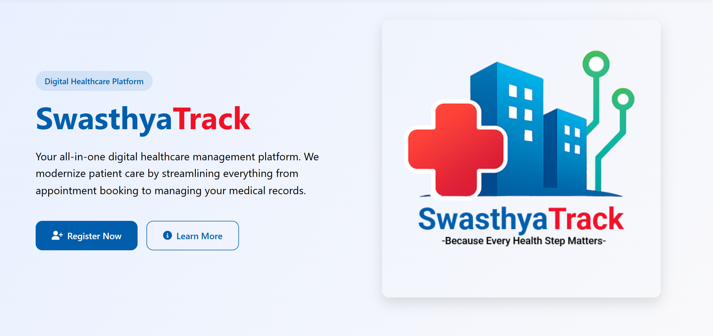

SwasthyaTrack is a web-based hospital management system designed to streamline core hospital operations. It integrates patient registration, appointment booking, bed management, and medical record storage into a single platform. Patients can create accounts, manage appointments and beds, upload medical reports, and view prescriptions. Doctors can access their schedules, mark appointments, and generate digital prescriptions. Nurses can upload patient reports and assist with appointments, while administrators manage user accounts, appointments, and resources through a dedicated dashboard.

The system uses secure practices (e.g., hashed passwords, safe file handling) and is deployed on Linux (via WSL2) with Docker containers for consistent and reliable operation.

## Features

### Patient Portal

- Register a new account and log in (credentials are validated and stored securely).
- Book, edit, or cancel doctor appointments by selecting a doctor, date, and time slot.
- Reserve and cancel hospital beds (bed status updates to **Reserved**, **Empty**, **Occupied** or **Out of Order** as needed).
- Upload personal medical reports (PDFs) to their profile and view reports uploaded by nurses.
- View prescriptions issued by doctors after consultations.

### Doctor Dashboard

- View all scheduled appointments and mark them as **completed**, **booked**, or **cancelled**.
- Write and submit prescriptions via a form (medicines, dosages, instructions); saved prescriptions become visible to patients.

### Nurse Panel

- View all appointments assigned to doctors and update appointment statuses if needed.
- Upload patient medical reports (attach files, enter metadata) which are securely stored and linked to patient records.

### Administrator Dashboard

#### User Management

- Add new users (doctors, nurses, admins, etc.) by filling user details and assigning roles.
- Update or delete existing user accounts.
- Reset passwords as needed.

#### Appointment Management

- View all appointments hospital-wide.
- Update, or cancel appointments to accommodate scheduling changes.

#### Bed Management

- Add or remove hospital beds.
- Change bed details or status (**empty/reserved/occupied/out of order**).

## Tech Stack

- **Platform:** Linux (Ubuntu on WSL2) with Docker and Docker Compose for containerization.
- **Server & Runtime:** Apache HTTP Server running PHP (server-side scripting).
- **Database:** MySQL relational database (with phpMyAdmin for administration).
- **Frontend:** HTML5, CSS3, and JavaScript (vanilla) for pages and client-side validation.
- **Frameworks/Libraries:** LAMP stack (Linux, Apache, MySQL, PHP) forms the core backend. No external JS/CSS frameworks were required.

All tools and libraries used are open-source and well-documented, making the environment easy to set up and extend.

## System Design

The system design of SwasthyaTrack was modeled using standard software engineering diagrams to clearly represent system functionality, data flow, and system components.

### Use Case Diagram

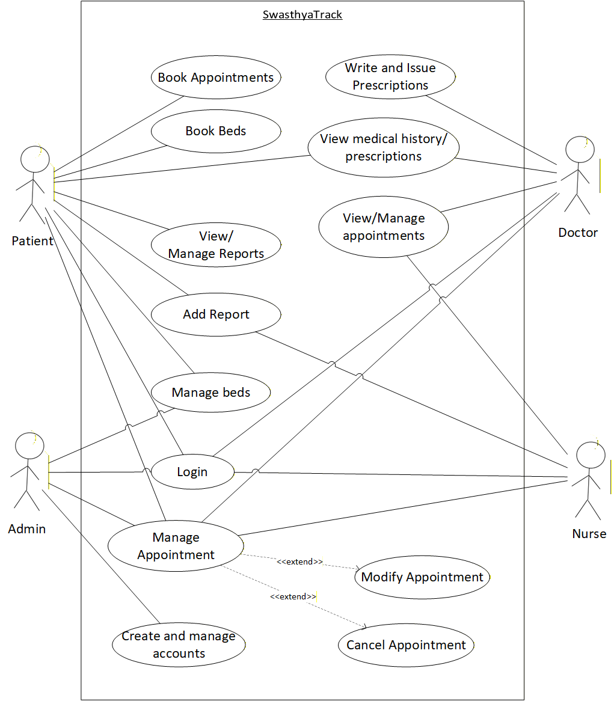

### DFD – Level 0

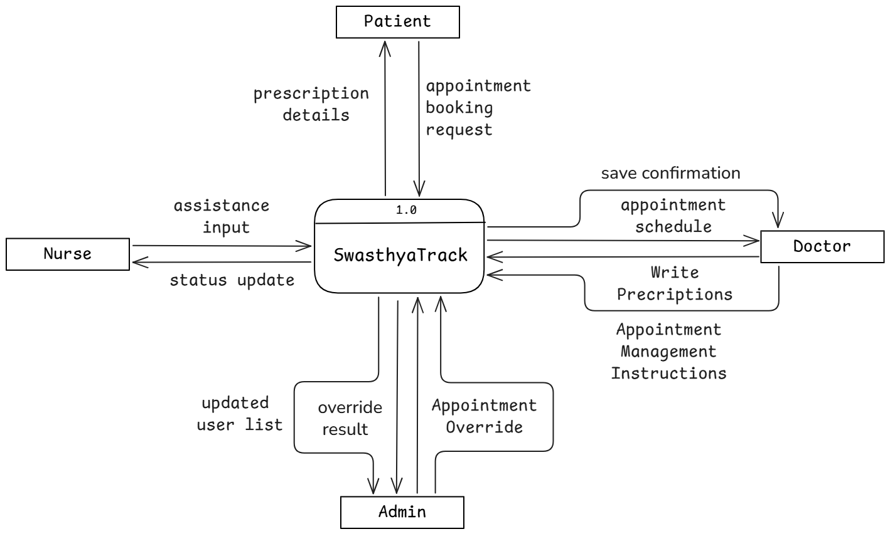

### DFD – Level 1

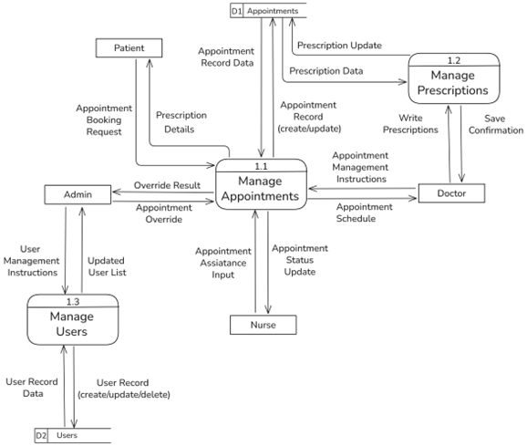

### Physical DFD

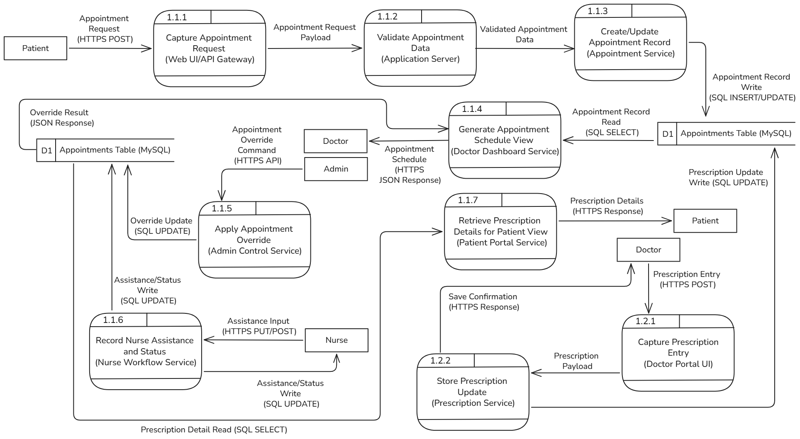

### Entity Relation Diagram

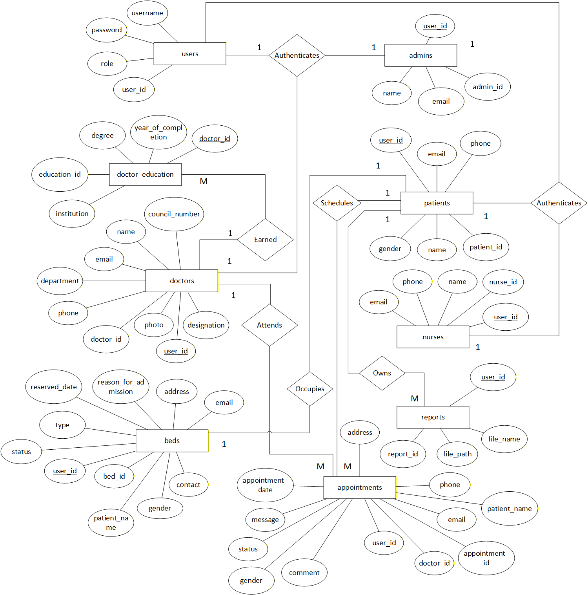

## System Architecture

SwasthyaTrack follows a **three-tier client–server architecture** consisting of a presentation layer, an application layer, and a data layer.

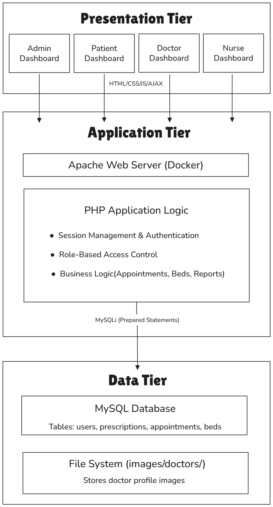

### 1️. Presentation Layer (Client):

This layer provides the browser-based user interface built with **HTML, CSS, JavaScript, and AJAX**. It includes dashboards for **Admin, Patient, Doctor, and Nurse**. Users interact with the system through forms and pages such as login, appointment booking, report viewing, and dashboards. The client sends requests to the server using HTTP.

### 2. Application Layer (Server):

The backend logic is implemented using **PHP running on the Apache Web Server**. This layer processes incoming requests from the client and performs the core system operations such as **authentication, session management, role-based access control, appointment management, bed management, report handling, and prescription generation**. It also communicates with the database to retrieve and store data.

### 3. Data Layer (Database):

The system uses a **MySQL database** to store all persistent data including **users, appointments, beds, reports, and prescriptions**. The database maintains data consistency and relationships through primary keys, foreign keys, and constraints.

All layers communicate through **HTTP requests and database queries**. For example, when a patient books an appointment, the request is sent from the browser to the PHP backend, which processes the request and updates the MySQL database.

The application is deployed using **Docker containers running inside a Linux environment provided by WSL2**, which ensures portability and consistent deployment across different systems.

## Database Schema

The system uses a centralized relational database with the following core tables:

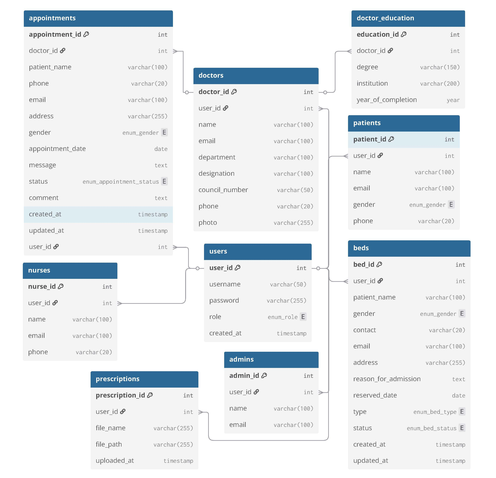

### Core Tables

- **users**: login credentials and role (`patient`, `doctor`, `nurse`, `admin`)
- **doctors / patients / nurses / admins**: role-specific profile tables linked to `users` via `user_id` (1:1)
- **appointments**: patient bookings with doctors, status tracking (`Booked`, `Cancelled`, `Completed`)
- **doctor_education**: multiple education records per doctor (1:many)
- **beds**: bed availability/reservation with type and status
- **prescriptions**: uploaded report/prescription file metadata per user

### Key Relationships

- `users` → role tables (`doctors`, `patients`, `nurses`, `admins`)
- `doctors` → `appointments`
- `doctors` → `doctor_education`
- `users` → `appointments`, `beds`, `prescriptions`

### Notes

- Foreign keys are defined for referential integrity.
- Cascading/nullable deletes are used where appropriate (e.g., preserve history in appointments).

## Installation Guide (WSL2 + Docker)

### Prerequisites

- Windows with **WSL2** enabled
- **Docker Desktop** (with WSL integration turned on)
- **Git** (optional, for cloning)

### 1) Clone project and open in WSL

```bash
git clone https://github.com/UnishRzk/swasthyatrack-hospital-management-system
cd swasthyatrack-hospital-management-system
```

### 2) Project structure

Make sure these files exist at project root:

- `docker-compose.yml`
- `Dockerfile`
- `src/` (PHP app source code)

### 3) Start containers

```bash
docker compose up --build -d
```

This starts:

- Apache/PHP app → `http://localhost:8080`
- MySQL 8.0 → `localhost:3306`
- phpMyAdmin → `http://localhost:8081`

### 4) Database setup

1. Open phpMyAdmin: `http://localhost:8081`
2. Login:
   - **Server:** `mysql`
   - **Username:** `root`
   - **Password:** `root`
3. Create database (if needed): `swasthyatrack`
4. Import your SQL dump file
5. Import file from: **`database/swasthyatrack.sql`**

> Note: `docker-compose.yml` creates `testdb` by default.  
> If your app expects `swasthyatrack`, either:
>
> - create/import `swasthyatrack` manually in phpMyAdmin, or
> - change `MYSQL_DATABASE` in `docker-compose.yml` to `swasthyatrack`.

### 5) Configure app DB connection

Set your PHP DB config to:

- **Host:** `mysql`
- **Port:** `3306`
- **User:** `root` (or `user`)
- **Password:** `root` (or `password`)
- **Database:** `swasthyatrack` (or `testdb`, depending on your setup)

### 6) Verify

- App loads: `http://localhost:8080`
- phpMyAdmin loads: `http://localhost:8081`
- Containers running:

```bash
docker ps
```

---

## Installation Guide (XAMPP)

### Prerequisites

- **XAMPP** (Apache + MySQL + phpMyAdmin)
- Windows/Linux/macOS

### 1) Copy project into XAMPP web root

- Put project folder inside:
  - Windows: `C:\xampp\htdocs\`
  - Linux: `/opt/lampp/htdocs/`
- Example:
  - `C:\xampp\htdocs\swasthyatrack-hospital-management-system\src`

### 2) Start services

Open XAMPP Control Panel and start:

- **Apache**
- **MySQL**

### 3) Database setup

1. Open phpMyAdmin: `http://localhost/phpmyadmin`
2. Create database: `swasthyatrack`
3. Import file from: **`database/swasthyatrack.sql`**

### 4) Configure app DB connection

Update your PHP DB config for XAMPP:

- **Host:** `localhost`
- **Port:** `3306`
- **User:** `root`
- **Password:** _(empty by default in XAMPP)_
- **Database:** `swasthyatrack`

### 5) Run application

Open in browser:

- `http://localhost/swasthyatrack-hospital-management-system/src`

### 6) Common fix

If MySQL port `3306` is busy, change MySQL port in XAMPP and use that same port in your DB config.

## Testing Overview

SwasthyaTrack underwent both **unit testing** and **system testing**.

### Unit Testing

Each module (signup, login, booking, etc.) was tested independently with predefined test cases.  
For example, the signup module was tested for:

- Valid inputs (successful account creation)
- Invalid inputs (empty fields, incorrect email format, etc.)

Test results were tabulated by comparing **expected** and **actual** outcomes to verify correctness.

### System Testing

After unit tests, full end-to-end scenarios were executed to validate integrated workflows.  
System testing covered:

- User signup and login
- Appointment booking
- Invalid credential handling
- Bed booking categories (available vs full)
- Appointment editing

Each scenario included clear preconditions and expected outcomes, and all core functionalities passed as expected.


### Outcome

The testing strategy ensured that:

- Each feature worked correctly in isolation
- Modules functioned reliably together
- Error handling was validated throughout the application flow

### Detailed Testing Document

For complete test cases and result tables, see:

- [docs/Testing/Testing.pdf](docs/Testing/Testing.pdf)

## Further Documentation

- Project Report: [docs/project-report.pdf](docs/project-report.pdf)

## Screenshots

Below are example screenshots of the SwasthyaTrack user interface.

### Landing Page


### Login Page

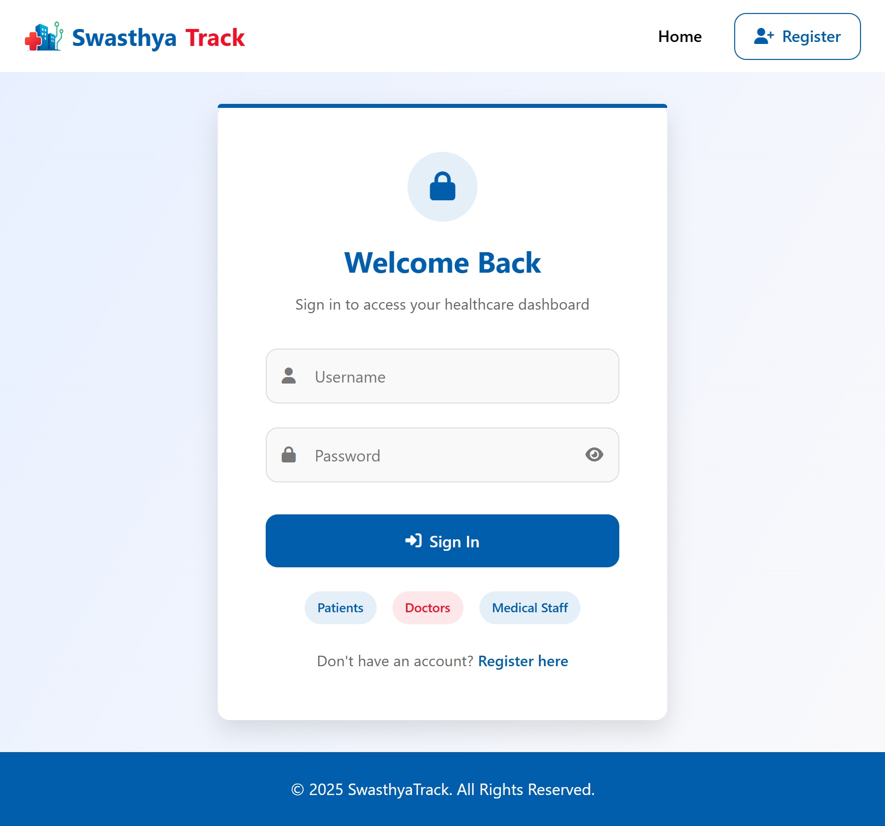

### Register Page

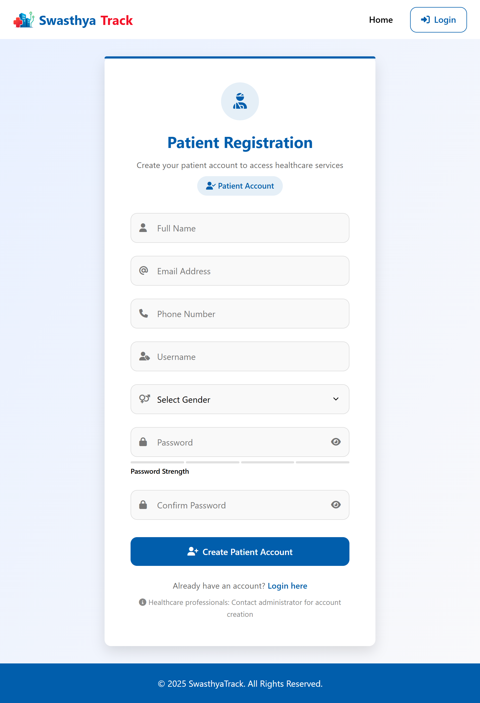

### Patient Dashboard

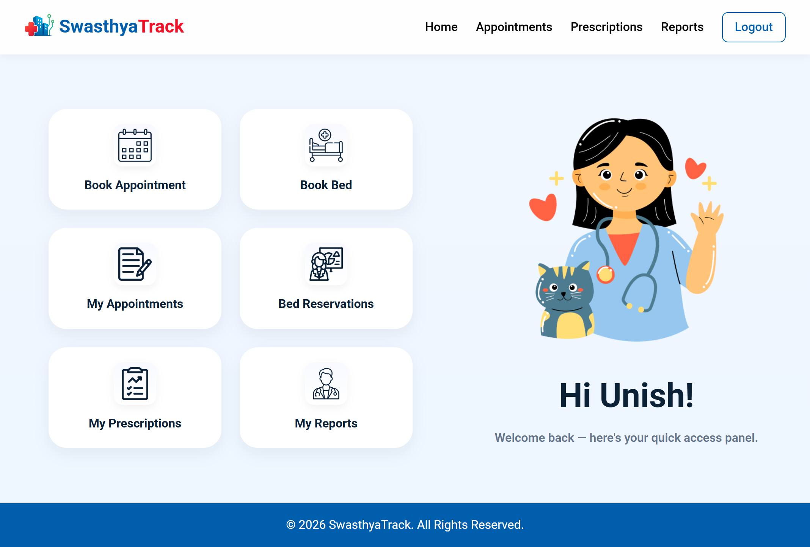

### Select Doctors Page

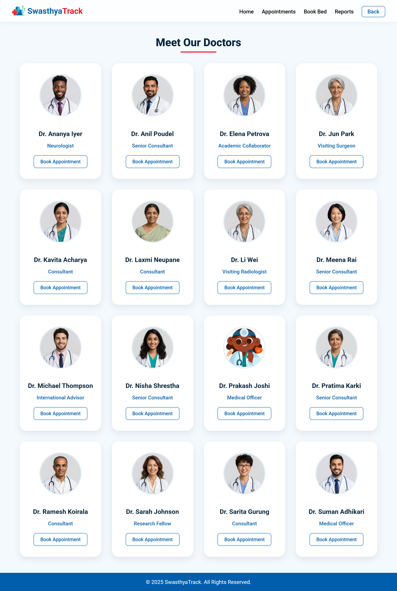

### Book Appointment Page

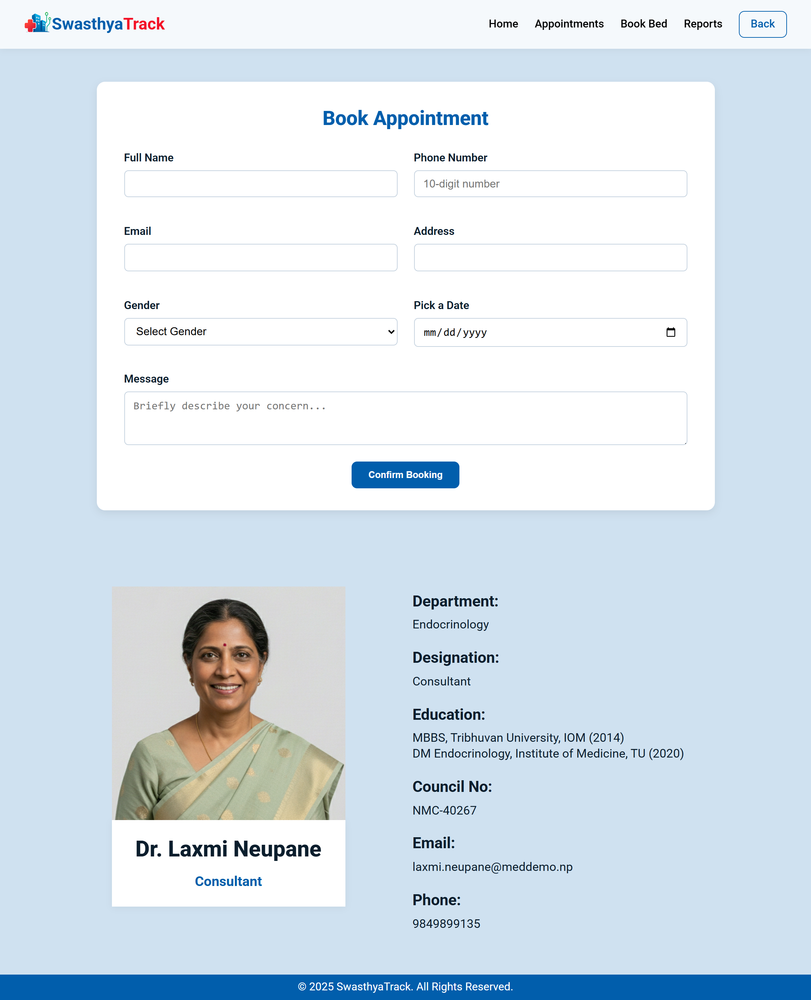

### Book Bed Page

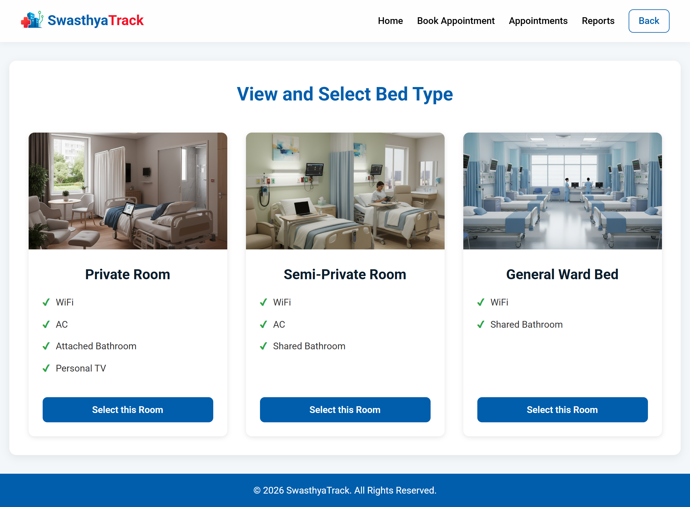

### My Appointments Page

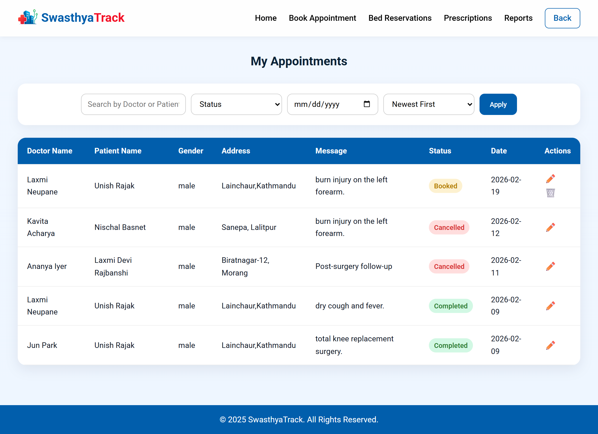

### Prescription

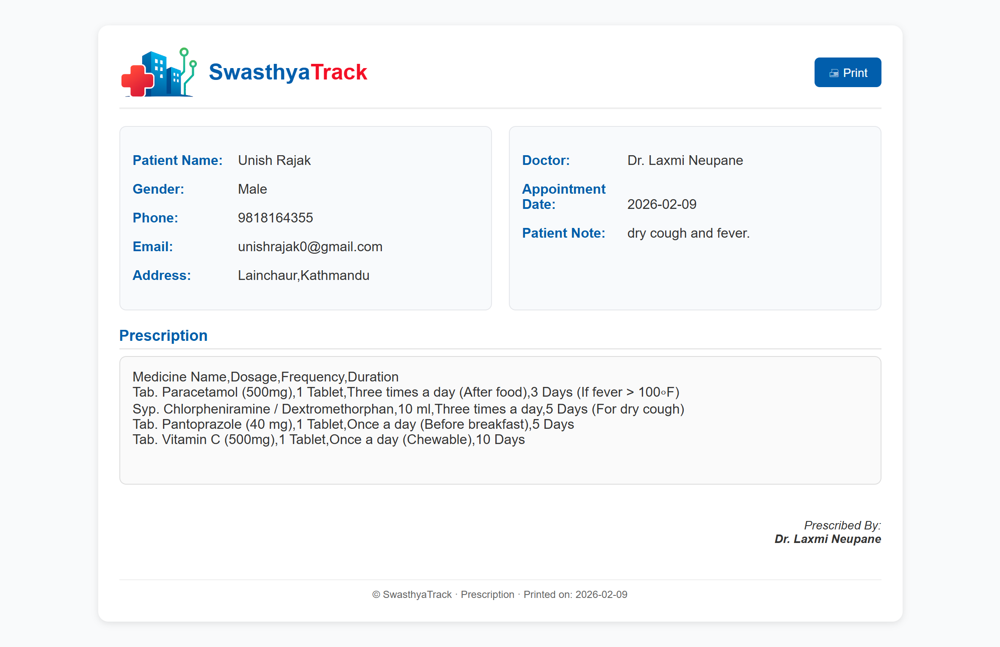

### Admin Dashboard

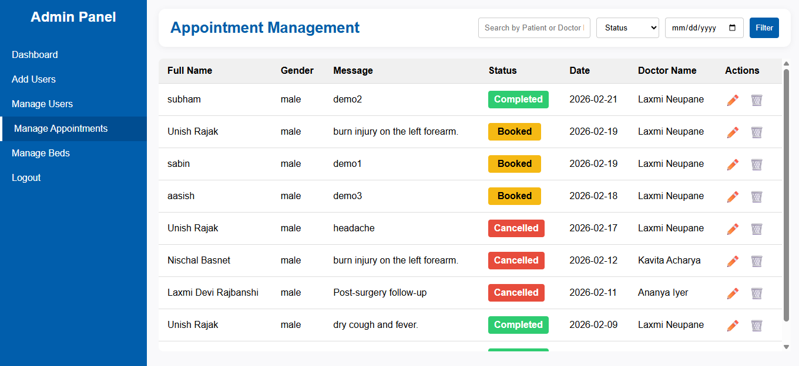

### Doctor Dashboard

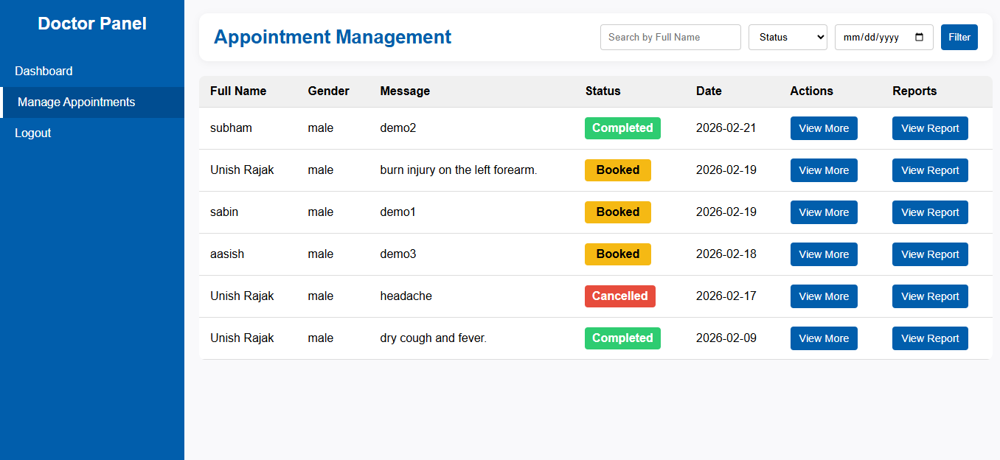

Each screenshot illustrates the clean UI and role-specific features (e.g., dashboards showing upcoming appointments, forms for booking, and tables for management).

## Limitations and Future Improvements

### Current Limitations

- **Scope:** The current system covers core hospital functions only. Advanced features like billing, inventory tracking, insurance integration, and analytics are not implemented yet.
- **Deployment:** It requires a stable web connection and is designed as an academic prototype. It has not been tested for high-volume enterprise use.
- **Mobile Access:** There is no dedicated mobile app; users must access the system via a browser.
- **Multi-Branch Support:** The system is single-organization only; it does not currently support multiple branches or hospitals.


## Future Improvements

Potential enhancements include:

- Adding modules for **billing** and **pharmacy**
- Building a **mobile-friendly interface** (or dedicated mobile app)
- Supporting **multiple hospital locations/branches**
- Introducing **analytics dashboards** (e.g., patient flow, bed occupancy trends)
- Exploring integrations with **external lab systems** or **health information exchanges**

# Contributing

Thanks for your interest in **SwasthyaTrack**.

This project was developed as an academic/personal project and is **no longer actively maintained**.  
At this time, I am **not accepting contributions, pull requests, or feature requests**.

You may still fork and modify the project for your own learning or use, according to the license.

## License

This project is licensed under the [MIT License](LICENSE).